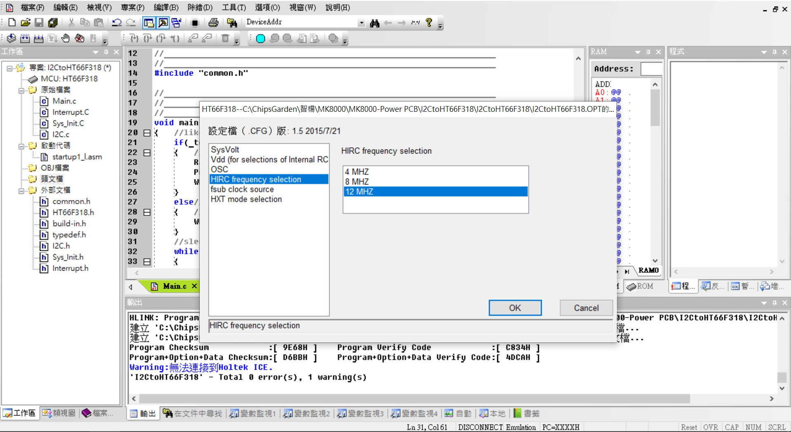

## ※Access internal EEPROM of HT66F318 (via I2C slave address 0x33) applications
* Using the host I2C access MCU internal resource GPIO, EEPROM(64bytes), ADC(8ch 12bits), PWM output(10bit), Capture, OLED display... 
專案利用PC or Raspberry Pi or Arduino 軟件主控通過I2C下達通訊指令以存取GPIO port, EEPROM(64bytes), ADC(8ch 12bits), PWM output(10bit), Capture, OLED display... 
* 在MCU資源不足或是應用裝置缺乏時, Host即可透過I2C來控制這個裝置而把UART port use for other 

* Project Option:  
HIRC12M (hi speed internal RC): 可選項有:HXT(400K~16Mhz),HIRC4M,HIRC8M,HIRC12M 
LICR (Low speed internal RC for TB0/TB1): 可選項有:LXT(32.768Khz),LIRC(32Khz) 
So no need any external OSC. or X'tal in this project. 
WatchDog: enable 

* TB0,1 enable LIRC interrupt for 16.05ms, 0.514sec 

* TM0 enable HIRC12M (hi speed internal RC) interrupt for around 200us 

* EEPROM data:
0A 0B 0C 0D 0E 0F 0E 0D 

* I2C slave(address 0x33)
SDA(PC5),SCL(PC6) Host(PC or Raspberry Pi)速度必須在100K/bps以下, 連續的read/write更可能要在50K/bps(HIRC8M)  
HT66F318 Internal RC HIRC8M/HIRC12M 兩種HIRC也有差別的  
> I2C slave 開機後複製EEPROM data(0A 0B 0C 0D 0E 0F 0E 0D)置於I2C傳輸的緩衝當中, 準備被I2C提取(host read) 
> I2C slave 收到host write 8 bytes資料後暫放置於準備傳輸的緩衝當中, 準備被I2C提取(host read) 
> 請注意I2C slave傳送前有哪些資料在緩衝區
> 一次性長度(Read or Write), 最長為8bytes

* HT-IDE3000 HT66F317/HT66F318 28ssop with HT-IDE3000 & e-Link & e-WriterPro 
文件[HT66F318 Document](https://www.holtek.com.tw/search?key=ht66F318) 
模擬&除錯Development & Debug[IDE3000 & ICE](https://www.holtek.com.tw/web/guest/ice) 
燒入器Progrmming & writer[HOPE3000 & e-WriterPro](https://www.holtek.com.tw/web/guest/programmer) 

### Relevant information
* HT-IDE3000 V8.02

* HOLTEK C Compiler V3/Assembly

* HT66F318 Config, used 8Mhz X'tal external, VDD/VDDA binding

* HT66F318 28ssop Schematic Diagram

### How to test or used
Using PC or Raspberry Pi or Arduino Host software control I2C of MCU (Slave address 0x33)
* For Example 5digit (20000count)AD converter ICL7135
> I2C Formate: @33 AA BB CC DD EE

* For Example 16bits x 4digit LED matrix
> I2C Formate: @33 D1 D2 D3 D4 D5 6D D7 D8

